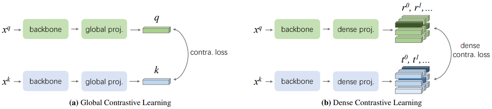
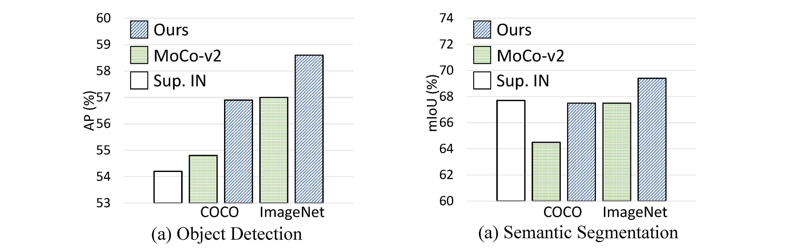

# Dense Contrastive Learning for Self-Supervised Visual Pre-Training

This project hosts the code for implementing the DenseCL algorithm for self-supervised representation learning.

> [**Dense Contrastive Learning for Self-Supervised Visual Pre-Training**](https://arxiv.org/abs/2011.09157),  
> Xinlong Wang, Rufeng Zhang, Chunhua Shen, Tao Kong, Lei Li   
> In: Proc. IEEE Conf. Computer Vision and Pattern Recognition (CVPR), 2021, **Oral**  
> *arXiv preprint ([arXiv 2011.09157](https://arxiv.org/abs/2011.09157))*   



## Highlights
- **Boosting dense predictions:**  DenseCL pre-trained models largely benefit dense prediction tasks including object detection and semantic segmentation (up to +2% AP and +3% mIoU).
- **Simple implementation:** The core part of DenseCL can be implemented in 10 lines of code, thus being easy to use and modify.
- **Flexible usage:** DenseCL is decoupled from the data pre-processing, thus enabling fast and flexible training while being agnostic about what kind of augmentation is used and how the images are sampled.
- **Efficient training:**  Our method introduces negligible computation overhead (only <1% slower) compared to the baseline method.



## Updates
   - [Simple tutorial](https://github.com/aim-uofa/AdelaiDet/blob/master/configs/DenseCL/README.md) for using DenseCL in AdelaiDet (e.g., with SOLOv2 and FCOS) is provided. (05/16/2021)
   - Code and pre-trained models of DenseCL are released. (02/03/2021)


## Installation
Please refer to [INSTALL.md](docs/INSTALL.md) for installation and dataset preparation.

## Models
For your convenience, we provide the following pre-trained models on COCO or ImageNet.

pre-train method | pre-train dataset | backbone | #epoch | training time | VOC det | VOC seg | Link
--- |:---:|:---:|:---:|:---:|:---:|:---:|:---:
Supervised | ImageNet | ResNet-50 | - | - | 54.2 | 67.7| [download](https://cloudstor.aarnet.edu.au/plus/s/W2FST2pxKrC6HWp/download)
MoCo-v2 | COCO | ResNet-50 | 800 | 1.0d | 54.7 | 64.5 | [download]()
DenseCL | COCO | ResNet-50 | 800 | 1.0d | 56.7 | 67.5 | [download](https://cloudstor.aarnet.edu.au/plus/s/W5oDyYB218xz625/download)
DenseCL | COCO | ResNet-50 | 1600 | 2.0d | 57.2 | 68.0 | [download](https://cloudstor.aarnet.edu.au/plus/s/3GapXiWuVAzdKwJ/download)
MoCo-v2 | ImageNet | ResNet-50 | 200 | 2.3d | 57.0 | 67.5 | [download]()
DenseCL | ImageNet | ResNet-50 | 200 | 2.3d | 58.7 | 69.4 | [download](https://cloudstor.aarnet.edu.au/plus/s/hdAg5RYm8NNM2QP/download)
DenseCL | ImageNet | ResNet-101 | 200 | 4.3d | 61.3 | 74.1 | [download](https://cloudstor.aarnet.edu.au/plus/s/4sugyvuBOiMXXnC/download)

**Note:** 
- The metrics for VOC det and seg are AP (COCO-style) and mIoU. The results are averaged over 5 trials.
- The training time is measured on 8 V100 GPUs.
- See our paper for more results on different benchmarks.

We also provide experiments of using DenseCL in AdelaiDet models, e.g., SOLOv2 and FCOS. Please refer to the [instructions](https://github.com/aim-uofa/AdelaiDet/blob/master/configs/DenseCL/README.md) for simple usage.

- SOLOv2 on COCO Instance Segmentation

pre-train method | pre-train dataset  |  mask AP | 
--- |:---:|:---:|
Supervised  | ImageNet | 35.2  
MoCo-v2  | ImageNet | 35.2
DenseCL |  ImageNet | 35.7 (+0.5)

- FCOS on COCO Object Detection

pre-train method | pre-train dataset  |  box AP | 
--- |:---:|:---:|
Supervised   | ImageNet | 39.9
MoCo-v2  | ImageNet | 40.3
DenseCL |  ImageNet | 40.9 (+1.0)


## Usage

### Training
    ./tools/dist_train.sh configs/selfsup/densecl/densecl_coco_800ep.py 8

### Extracting Backbone Weights
    WORK_DIR=work_dirs/selfsup/densecl/densecl_coco_800ep/
    CHECKPOINT=${WORK_DIR}/epoch_800.pth
    WEIGHT_FILE=${WORK_DIR}/extracted_densecl_coco_800ep.pth
    
    python tools/extract_backbone_weights.py ${CHECKPOINT} ${WEIGHT_FILE}

### Transferring to Object Detection and Segmentation
Please refer to [README.md](benchmarks/detection/README.md) for transferring to object detection and semantic segmentation.
Please refer to the [instructions](https://github.com/aim-uofa/AdelaiDet/blob/master/configs/DenseCL/README.md) for transferring to dense prediction models in AdelaiDet, e.g., SOLOv2 and FCOS.

### Tips
- After extracting the backbone weights, the model can be used to replace the original ImageNet pre-trained model as initialization for many dense prediction tasks. 
- If your machine has a slow data loading issue, especially for ImageNet, your are suggested to convert ImageNet to lmdb format through [folder2lmdb_imagenet.py](tools/folder2lmdb_imagenet.py) or  [folder2lmdb_coco.py](tools/folder2lmdb_coco.py), and use this [config_imagenet](configs/selfsup/densecl/densecl_imagenet_lmdb_200ep.py) or [config_coco](configs/selfsup/densecl/densecl_coco_lmdb_800ep.py) for training. 

## Acknowledgement
We would like to thank the [OpenSelfSup](https://github.com/open-mmlab/OpenSelfSup) for its open-source project and [PyContrast](https://github.com/HobbitLong/PyContrast) for its detection evaluation configs.

## Citations
Please consider citing our paper in your publications if the project helps your research. BibTeX reference is as follow.
```
@inproceedings{wang2020DenseCL,
  title={Dense Contrastive Learning for Self-Supervised Visual Pre-Training},
  author={Wang, Xinlong and Zhang, Rufeng and Shen, Chunhua and Kong, Tao and Li, Lei},
  booktitle =  {Proc. IEEE Conf. Computer Vision and Pattern Recognition (CVPR)},
  year={2021}
}
```
